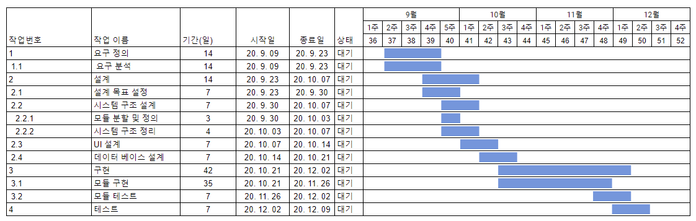

# 💻 KNUSD-20202-Team6 
## 프로젝트명 : 스터디그룹을 위한 출석 및 진행도 공유 웹페이지
###### (수정일 : 2020년 9월 16일)
 + 팀원 👨‍👨‍👦‍👦 : 장영우 , 조승희 , 송동후 , 송현수

***

### __1. 목적 및 필요성__
    코로나19로 인해 사회적 거리두기 및 서로간의 대면을 피하는 분위기가 조성되는 현 상황에 맞춰 
    스터디그룹을 비대면 상황에서도 효과적으로 진행하기 위한 아이디어로 웹페이지를 이용한 출석 및 
    진행도 공유 시스템을 구상하게 되었다.

***

### __2.내용 및 추진 방법__
    ●구체적인 기능 :  스터디그룹 팀원간의 출석 및 학습 진행 현황 공유
                  출석률, 학습진행도의 그래프를 이용한 시각화 

    ●개발 환경 및 툴　: 파이썬 플라스크 , 장고

    ●팀원별 역할분담　: 장영우 , 조승희 – 모듈구현
                  손동후 – UI 구현
                  송현수 – 데이터 베이스 구현

***

### __3. 추진 일정__

***

### __4. 기대효과 및 활용방안__
    1.개인적 동기부여의 활성화
    평소에 개인적으로 목표를 정햇지만, 다른 일이 바빠서 잊혀지거나, 또는 자신의 의지가 부족하여
    그 일을 완성하지 못한 채 흐지부지 끝낸 경험이 있을 것이다.
    따라서, 누구나 자신이 목표를 향해 가면서 자신의 목표를 잊지 않을 수 있도록, 스스로의 성취정도를
    돌이킬 수 잇는 수단이 필요하다. 이런 상황에서, 우리의 자기목표관리 프로그램은 본인이 스스로의
    나태함을 예방할 수 있는 좋은 도구가 될 것이다.

    2.경쟁적 분위기 활성화
    경쟁이 항상 나쁜 것만은 아니다. 오히려 경쟁은 서로가 서로의 페이스메이커 역할을 할 수 있게하며,
    때로는 본인의 실력 이상을 발휘하게 해 준다. 
    우리의 자기목표관리 프로그램은 스스로가 자신의 성취도를 체크할 수 있을 뿐만 아니라, 다른 사람과 
    그 성취를 공유할 수 있게 해 줄 것이다.
    따라서, 목표가 비슷한 사람끼리는 선의의 경쟁을, 성취도가 부족한 사람에게는 성취도를 올려야 
    하겟다는 욕망을 촉진시킬 수 있을 것이다.

    3.활용방안
    평소 알고 지내던 친구들이나 단체 모임에서 사용하게 된다면, 평소 알던 사람끼리의 성취 공유가
    무특정 다수에게 공유하는 것보다는 훨씬 편안할 것이다. 또한, 코로나19로 인해 대면이 제한적인
    상황이라면 온라인으로 쉽게 서로의 성취도를 공유할 수 있을 것이다.
    
***

### __참고자료__

+ 어플 챌린저스 : <https://www.chlngers.com/>

***

